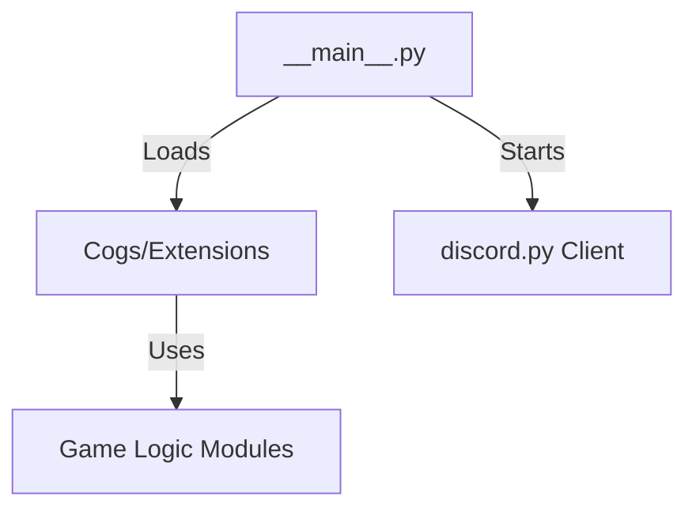

# Cipher 🤖 — Modular Discord Minigames Bot

[](https://www.python.org/)
[](LICENSE)
[](https://buymeacoffee.com/dvanhecke)
[](https://snyk.io/test/github/dvanhecke/cipher-bot)
[

---

## Overview

Cipher is a **modular, asynchronous Discord bot** focused on **fun minigames**, fully designed to be **plug-and-play**.  
It runs smoothly on lightweight setups like a **Raspberry Pi 3 B (headless)** and is written in **Python 3.13** using **discord.py**.

All cogs are independent, and game logic is fully separated from Discord interactions, making the bot **testable, maintainable, and extendable**.

---

## Features

- **Modular Cogs** — Hangman, Rock-Paper-Scissors, Number Guessing, and more
- **Async Architecture** — Uses `asyncio` with graceful shutdown using `asyncio.shield`
- **Hybrid Commands** — Supports both slash commands and prefix commands
- **Owner-only Admin Commands** — e.g., `ping` for latency checks
- **Easy Deployment** — Headless on Raspberry Pi, monitored with `tmux` and optionally exposed via `ngrok`
- **Environment-based Configuration** — `.env` file for tokens and command prefix

---

## Architecture



- **Main**: Entry point that loads cogs and starts the bot
- **Cogs**: Handles Discord events and connects them to game logic
- **Game Logic**: Pure Python modules that are fully testable
- **Discord API**: Handles commands, interactions, and events

---

## Installation

### Option 1 - Manual Setup

```bash
git clone https://github.com/dvanhecke/cipher-bot.git
cd cipher
pipenv install
```

Create a `.env` file:

```
BOT_TOKEN=your_discord_token
COMMAND_PREFIX=!
```

Run the bot:

```bash
pipenv run python -m cipher
```

> Recommended: Run inside a `tmux` session for headless monitoring.

### Option 2 — Add via Discord

You can also directly invite Cipher to your Discord server using the install link:
[Install Cipher on Discord](https://discord.com/oauth2/authorize?client_id=1415451280783966220)

---

## Adding a New Cog

1. Create a Python file in `cipher/cogs/`
2. Add a class that inherits from `commands.Cog`
3. Add the cog path to the `COGS` list in `__main__.py`

The bot will automatically load it at startup.

---

## Support

Enjoy Cipher? Help keep development flowing with a coffee:

<a href="https://www.buymeacoffee.com/akosbalasko" target="_blank"></a>

---

## License

Cipher is licensed under the **MIT License**. See [LICENSE](LICENSE) for full details.
