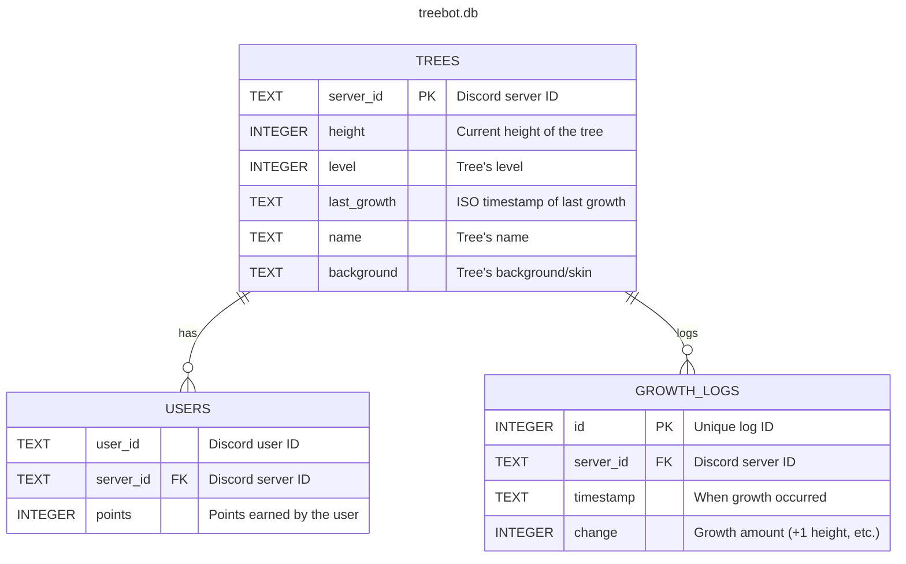

trees:

| Column        | Type             | Description                                 |
| ------------- | ---------------- | ------------------------------------------- |
| `server_id`   | TEXT PRIMARY KEY | Discord server ID                           |
| `height`      | INTEGER          | Current height of the tree                  |
| `level`       | INTEGER          | Tree’s level (can increase as height grows) |
| `last_growth` | TEXT             | ISO timestamp of last growth                |
| `name`        | TEXT             | Tree’s name (customizable)                  |
| `background`  | TEXT             | Tree’s background/skin                      |

users:

| Column      | Type    | Description                     |
| ----------- | ------- | ------------------------------- |
| `user_id`   | TEXT    | Discord user ID                 |
| `server_id` | TEXT    | Discord server ID (foreign key) |
| `points`    | INTEGER | Points earned by the user       |

growth_logs:

| Column      | Type                              | Description                              |
| ----------- | --------------------------------- | ---------------------------------------- |
| `id`        | INTEGER PRIMARY KEY AUTOINCREMENT | Unique log ID                            |
| `server_id` | TEXT                              | Discord server ID                        |
| `timestamp` | TEXT                              | When growth occurred                     |
| `change`    | INTEGER                           | How much the tree grew (e.g., +1 height) |


relationships:

```
trees.server_id  ──┐
                   │
                   ├── users.server_id  (one-to-many)
                   │
                   └── growth_logs.server_id (one-to-many)
```

ERdiagram:


